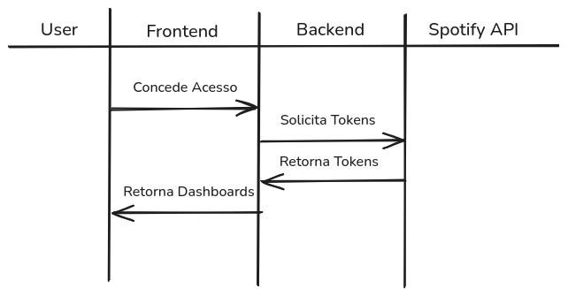
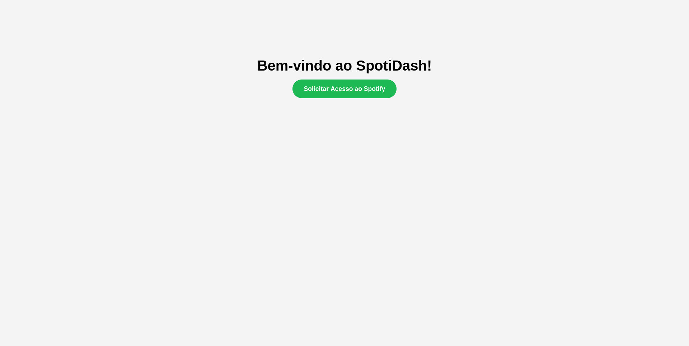
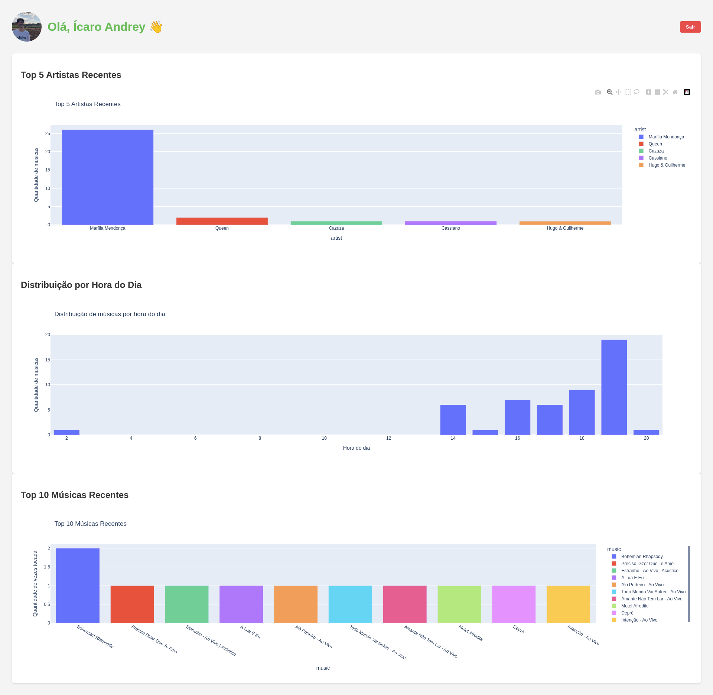

# 🎵 Spotify Dashboard

Este é um projeto de portfólio que consome a API do Spotify via OAuth2 para visualizar informações da conta do usuário, como playlists, músicas mais ouvidas, entre outros dados.



## 📸 Telas

### Primeiro Acesso


### Dashboard


## 🔧 Tecnologias utilizadas

- Python 3.12  
- Flask  
- Spotify Web API  
- Requests  
- Bootstrap (frontend)  
- python-dotenv (para variáveis de ambiente)

## 🚀 Como rodar o projeto localmente

### 1. Clone o repositório

```bash
git clone https://github.com/seu-usuario/spotify_dash.git
cd spotify_dash
```
### Crie e ative um ambiente virtual 
```bash
python -m venv venv
source venv/bin/activate  # Linux/macOS
venv\Scripts\activate     # Windows
```
### Instale as dependências
```bash
pip install -r requirements.txt
```
### Crie um arquivo .env na raiz do projeto com o seguinte conteúdo:

```python
FLASK_APP=app.py
FLASK_SECRET_KEY=sua_chave_secreta_flask
CLIENT_ID=seu_client_id_do_spotify
CLIENT_SECRET=seu_client_secret_do_spotify
REDIRECT_URI=http://127.0.0.1:5000/callback
```
### Pronto para rodar!
```bash
flask run
```
